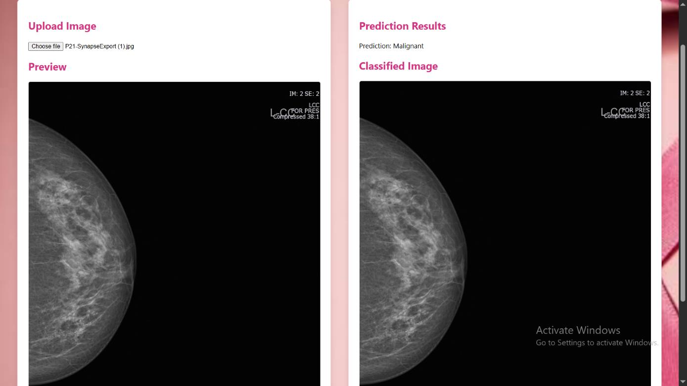
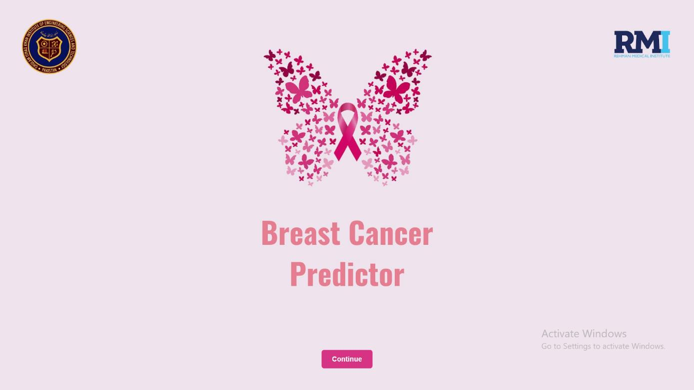
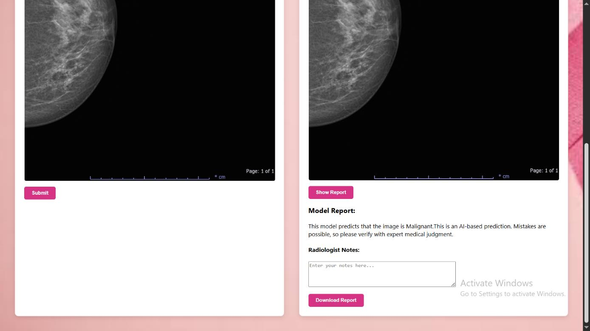
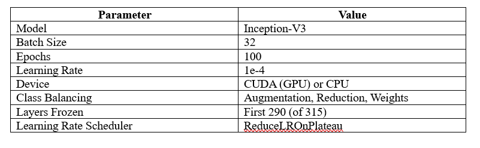
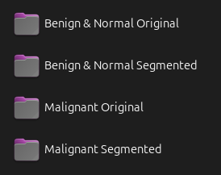
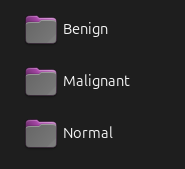
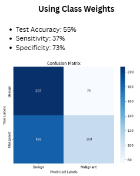

# Breast Cancer Detection System

A comprehensive AI-powered breast cancer detection system designed to assist radiologists in analyzing mammogram images. This project combines deep learning models with a user-friendly web interface to provide accurate predictions for breast cancer diagnosis.


*Main interface of the breast cancer detection system*

## 📋 Table of Contents

- [Project Overview](#project-overview)
- [Features](#features)
- [Technology Stack](#technology-stack)
- [Project Structure](#project-structure)
- [Installation](#installation)
- [Usage](#usage)
- [Model Information](#model-information)
- [API Documentation](#api-documentation)
- [Contributing](#contributing)
- [License](#license)

## 🎯 Project Overview

This breast cancer detection system is designed to assist medical professionals by providing AI-powered analysis of mammogram images. The system can classify breast tissue as either **Benign** or **Malignant** with high accuracy, serving as a valuable tool for radiologists to make more informed diagnostic decisions. The distinctive feature of this model is that it is fine tuned on South Asian Dataset.

### Key Objectives
- Provide accurate breast cancer detection using deep learning
- Assist radiologists with diagnostic decision-making
- Offer a user-friendly interface for medical professionals
- Generate comprehensive reports for patient records
- Ensure privacy and security of medical data

## ✨ Features

### 🖥️ User Interface
- **Welcome Screen**: Elegant butterfly-themed introduction
- **Image Upload**: Drag-and-drop or click-to-upload functionality
- **Real-time Preview**: Instant image preview before analysis
- **Responsive Design**: Works seamlessly on desktop and mobile devices
- **Navigation Menu**: Easy access to information, symptoms, and support


*Welcome screen with butterfly theme*


*Main application interface showing upload and results sections*

### 🔬 AI Analysis
- **Deep Learning Model**: State-of-the-art CNN architecture
- **Binary Classification**: Benign vs. Malignant prediction
- **Confidence Scoring**: Model confidence levels for predictions
- **Image Processing**: Automatic preprocessing and normalization

### 📊 Reporting System
- **PDF Report Generation**: Comprehensive diagnostic reports
- **Radiologist Notes**: Custom annotation capabilities
- **Image Storage**: Secure handling of medical images
- **Export Functionality**: Download reports in PDF format

### 🏥 Medical Features
- **Symptom Information**: Educational content about breast cancer symptoms
- **Privacy Policy**: HIPAA-compliant data handling
- **Contact Support**: Direct communication channels

## 🛠️ Technology Stack

### Backend
- **Python 3.12+**: Core programming language
- **Flask**: Web framework for API development
- **TensorFlow 2.18.0**: Deep learning framework
- **Keras**: High-level neural network API
- **NumPy**: Numerical computing library
- **PIL/Pillow**: Image processing library
- **Flask-CORS**: Cross-origin resource sharing

### Frontend
- **HTML5**: Semantic markup
- **CSS3**: Styling and responsive design
- **JavaScript (ES6+)**: Interactive functionality
- **jsPDF**: PDF generation library

### Machine Learning
- **TensorFlow/Keras**: Model training and inference
- **Convolutional Neural Networks (CNN)**: Image classification
- **Transfer Learning**: Pre-trained model fine-tuning
- **Data Augmentation**: Training data enhancement


*InceptionResNetV3 architecture used for breast cancer classification*


*Model training parameters and configuration*

## 📁 Project Structure

```
final files/
├── Backend/                          # Flask API server
│   ├── server.py                     # Main Flask application
│   ├── predict.py                    # Prediction utilities
│   ├── radiologists.db               # Database for radiologist data
│   ├── static/                       # Static file storage
│   │   ├── image.jpg                 # Uploaded image storage
│   │   └── contoured_image.jpg       # Processed image output
│   └── back-env/                     # Python virtual environment
│
├── Frontend/                         # Web interface
│   ├── index.html                    # Main HTML file
│   ├── styles.css                    # CSS styling
│   ├── bootstrap.css                 # Bootstrap framework
│   └── images/                       # UI assets
│       ├── Butterfly initial screen.jpg
│       ├── butterfly_white.jpg
│       └── [other UI images]
│
├── Models/                           # Trained ML models
│   ├── Finetuned on RMI/             # Models fine-tuned on RMI dataset
│   │   ├── final_model_using_class_weights.h5
│   │   └── final_model.h5
│   └── Trained on Public datasets/   # Models trained on public datasets
│       ├── public_dataset_colab_reduced_benign.h5
│       ├── public_dataset_colab_using_class_weights.h5
│       └── public_dataset_colab.h5
│
├── Notebooks/                        # Jupyter notebooks for development
│   ├── Finetuned on RMI/             # Fine-tuning notebooks
│   │   ├── fine_tuned_model(public dataset )_using_class_weights (Copy).ipynb
│   │   └── fine_tuned_model(public dataset ).ipynb
│   └── Trained on Public datasets/   # Training notebooks
│       ├── hyperparameter_tuning_public_dataset_colab.ipynb
│       ├── public_dataset_colab.ipynb
│       └── testing_public_datastes_on RMI.ipynb
│
├── photos/                           # Project documentation images
│   ├── Comparative Performance of Class Balancing Strategies.png
│   ├── fine_tuned_on RMI.png
│   ├── GUI_homepage_1.png
│   ├── GUI_homepage_2.png
│   └── [other documentation images]
│
└── FYP Report library 12[1].pdf      # Final Year Project Report
```

## 🚀 Installation

### Prerequisites
- Python 3.12 or higher
- pip (Python package installer)
- Git (for cloning the repository)

### Step 1: Clone the Repository
```bash
git clone <repository-url>
cd "final files"
```

### Step 2: Set Up Backend Environment
```bash
# Navigate to Backend directory
cd Backend

# Create virtual environment (if not already created)
python -m venv back-env

# Activate virtual environment
# On Windows:
back-env\Scripts\activate
# On macOS/Linux:
source back-env/bin/activate

# Install required packages
pip install -r requirements.txt
```

### Step 3: Install Dependencies
If `requirements.txt` is not available, install the following packages:
```bash
pip install flask==3.1.0
pip install flask-cors==5.0.0
pip install tensorflow==2.18.0
pip install pillow==11.1.0
pip install numpy==2.0.2
pip install requests==2.32.3
```

### Step 4: Download Models
Ensure the trained models are in the correct location:
```bash
# Copy the model file to Backend directory
cp "Models/Finetuned on RMI/final_model_using_class_weights.h5" Backend/
```

## 💻 Usage

### Starting the Backend Server
```bash
cd Backend
python server.py
```
The Flask server will start on `http://localhost:5000`

### Accessing the Frontend
1. Open `Frontend/index.html` in your web browser
2. Or serve it using a local web server:
```bash
cd Frontend
python -m http.server 8000
```
Then visit `http://localhost:8000`

### Using the Application
1. **Welcome Screen**: Click "Continue" to enter the main application
2. **Upload Image**: Select a mammogram image (JPG, PNG, JPEG)
3. **Preview**: Review the uploaded image
4. **Submit**: Click "Submit" to analyze the image
5. **Results**: View the prediction (Benign/Malignant)
6. **Report**: Generate and download PDF reports with radiologist notes

## 🤖 Model Information

### Model Architecture
- **Base Model**: Convolutional Neural Network (CNN)
- **Input Size**: 224x224 pixels
- **Output**: Binary classification (Benign/Malignant)
- **Activation**: Sigmoid for final layer
- **Optimizer**: Adam optimizer
- **Loss Function**: Binary crossentropy

### Training Data
- **Public Datasets**: Various publicly available mammogram datasets
- **RMI Dataset**: Fine-tuned on specific medical imaging data
- **Class Balancing**: Techniques applied to handle imbalanced data
- **Data Augmentation**: Rotation, scaling, and other transformations


*Dataset organization before preprocessing*


*Dataset organization after preprocessing and augmentation*

### Model Performance
- **Accuracy**: Approximately 70%
- **Class Weights**: Applied to handle class imbalance (Best performing among other Techniques).
- **Validation**: Cross-validation and holdout testing
- **Fine-tuning**: Transfer learning from pre-trained models



*Performance using class weights on public dataset Class Weights*


*Training and validation accuracy for public dataset model Class Weights*


*Training and validation loss for public dataset model Class Weights*


*Performance metrics of the model fine-tuned on RMI dataset*


*Training and validation accuracy for fine-tuned model*


*Training and validation loss for fine-tuned model*

### Available Models
1. **final_model_using_class_weights.h5**: Public Dataset model with class balancing finetuned on local Dataset(RMI)
2. **final_model.h5**: Public Dataset model finetuned on local Dataset(RMI)
3. **public_dataset_colab.h5**: Model trained on public datasets
4. **public_dataset_colab_using_class_weights.h5**: Public dataset model with class weights


*Comparative performance of different class balancing strategies*

### Model Configuration
- **Input Size**: 224x224 pixels
- **Normalization**: Pixel values divided by 255.0
- **Threshold**: 0.5 for binary classification
- **Batch Size**: 1 for inference

## 🧪 Testing

### Manual Testing
1. Upload various mammogram images
2. Test with different image formats
3. Verify prediction accuracy
4. Check PDF report generation

## 📊 Performance Optimization

### Model Optimization
- **Quantization**: Reduce model size for faster inference
- **Pruning**: Remove unnecessary model parameters
- **Batch Processing**: Process multiple images simultaneously

## 🔒 Security & Privacy

### Data Protection
- **HIPAA Compliance**: Medical data privacy standards
- **Secure Storage**: Encrypted image storage
- **Access Control**: Restricted access to medical data
- **Audit Logging**: Track all data access and modifications

### Security Measures
- **Input Validation**: Sanitize all user inputs
- **File Upload Security**: Validate file types and sizes
- **CORS Configuration**: Proper cross-origin settings
- **HTTPS**: Secure communication protocols

## 📝 License

This project is licensed under the MIT License - see the [LICENSE](LICENSE) file for details.

## 📞 Support

### Contact Information
- **Email**: hamzsyed12098@gmail.com
- **Issues**: Report bugs via GitHub Issues

## 🙏 Acknowledgments

- **Medical Professionals**: For domain expertise and validation
- **Open Source Community**: For libraries and frameworks
- **Research Community**: For published papers and datasets
- **Academic Advisors**: For guidance and supervision

## 📈 Future Enhancements

### Planned Features
- **Multi-class Classification**: Support for different cancer types
- **3D Image Support**: Analyze 3D mammogram volumes
- **Real-time Collaboration**: Multiple radiologists working together
- **Mobile Application**: Native iOS and Android apps
- **Cloud Deployment**: Scalable cloud infrastructure

### Research Directions
- **Federated Learning**: Privacy-preserving distributed training
- **Explainable AI**: Model interpretability and visualization
- **Clinical Integration**: EHR system integration

---

**⚠️ Medical Disclaimer**: This system is designed to assist medical professionals and should not be used as a replacement for professional medical diagnosis. Always consult with qualified healthcare providers for medical decisions. 